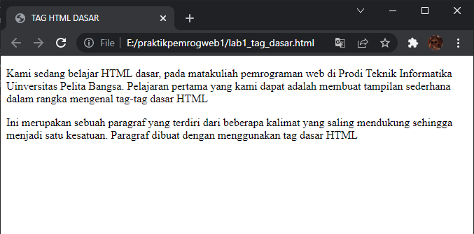
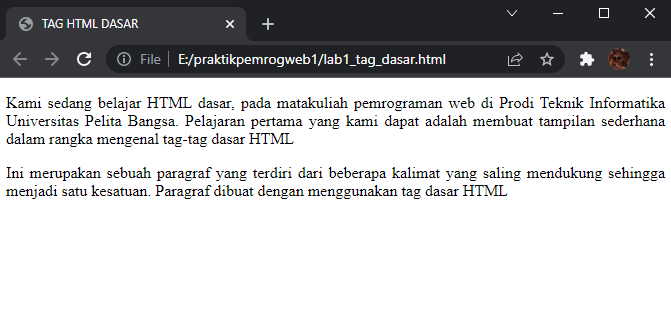
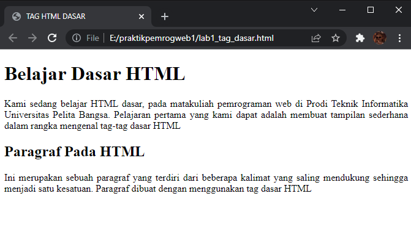
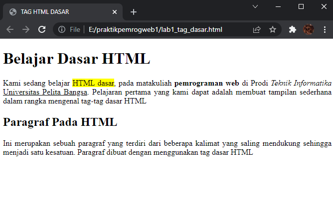
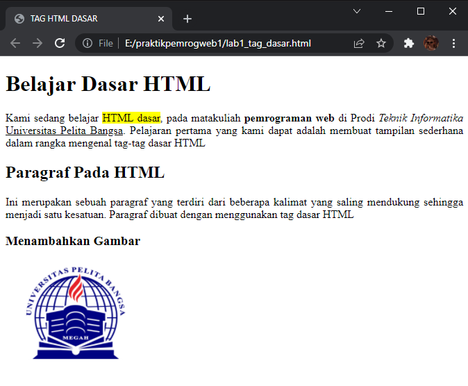
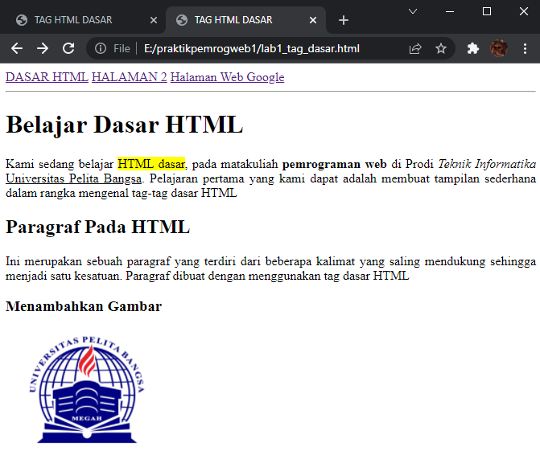
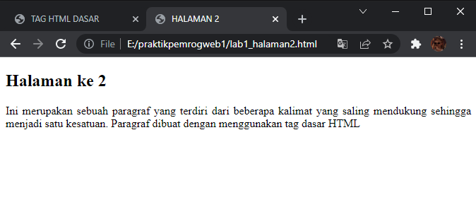

# Web1Lab1

**Nama    : Aning Kinanti** <br>
**NIM     : 312010364** <br>
**Kelas   : TI.20.A2** <br>
**Matkul  : Pemrograman Web** <br>

## Belajar Tag Dasar HTML

### 1. Membuat Paragraf
Kode tag untuk paragraf adalah `<p>`. <br>
Contoh codingnya seperti :
 ```
        <!-- ini paragraf pertama -->
        <p>Kami sedang belajar HTML dasar, pada matakuliah pemrograman web
            di Prodi Teknik Informatika Universitas Pelita Bangsa. Pelajaran pertama
            yang kami dapat adalah membuat tampilan sederhana dalam rangka mengenal tag-tag dasar HTML</p>
  
        <!-- ini paragraf kedua -->
        <p>Ini merupakan sebuah paragraf yang terdiri dari beberapa kalimat yang saling
            mendukung sehingga menjadi satu kesatuan. Paragraf dibuat dengan menggunakan
            tag dasar HTML</p>
```
<br>

Ini adalah tampilannya :
 <br>
 
 Kemudian atur atribut paragraf, contohnya align. <br>
 Nilai untuk atribut align seperti justify, center, left, right.

 Kode tag untuk mengatur atribut paragraf adalah `<p align=" ">` <br>
 Tambahkan atribut seperti contoh dibawah ini :
 ```
        <!-- ini paragraf pertama -->
        <p align="justify">Kami sedang belajar HTML dasar, pada matakuliah pemrograman web
            di Prodi Teknik Informatika Universitas Pelita Bangsa. Pelajaran pertama
            yang kami dapat adalah membuat tampilan sederhana dalam rangka mengenal tag-tag dasar HTML</p>
  
        <!-- ini paragraf kedua -->
        <p align="justify">Ini merupakan sebuah paragraf yang terdiri dari beberapa kalimat yang saling
            mendukung sehingga menjadi satu kesatuan. Paragraf dibuat dengan menggunakan
            tag dasar HTML</p>
 ```
<br>

Ini adalah tampilannya :
 <br>

### 2. Menambahkan Judul
Judul memiliki 6 level, mulai dari h1 sampai dengan h6. <br>
Tambahkan judul dengan `<h1>` sebelum paragraf pertama, dan `<h2>` sebelum paragraf kedua. <br>
Contoh codingnya seperti :
 ```
    <!-- judul paragraf pertama -->
      <h1>Belajar Dasar HTML</h1>
        <!-- ini paragraf pertama -->
        <p align="justify">Kami sedang belajar HTML dasar, pada matakuliah pemrograman web
            di Prodi Teknik Informatika Universitas Pelita Bangsa. Pelajaran pertama
            yang kami dapat adalah membuat tampilan sederhana dalam rangka mengenal tag-tag dasar HTML</p>
  
    <!-- judul paragraf pertama -->
      <h2>Paragraf Pada HTML</h2>
        <!-- ini paragraf kedua -->
        <p align="justify">Ini merupakan sebuah paragraf yang terdiri dari beberapa kalimat yang saling
            mendukung sehingga menjadi satu kesatuan. Paragraf dibuat dengan menggunakan
            tag dasar HTML</p>
```
<br>

Ini adalah tampilannya :
 <br>

### 3. Memformat Teks
Ada beberapa tag yang bisa digunakan untuk memformat teks pada paragraf. <br>
Diantaranya seperti : `<i>, <u>, <b>, <mark>, <small>`. <br>
Contoh codingnya seperti :
 ```
    <!-- judul paragraf pertama -->
      <h1>Belajar Dasar HTML</h1>
        <!-- ini paragraf pertama -->
        <p align="justify">Kami sedang belajar <mark>HTML dasar</mark>, pada matakuliah <b>pemrograman web</b>
            di Prodi <i>Teknik Informatika</i> <u>Universitas Pelita Bangsa</u>. Pelajaran pertama
            yang kami dapat adalah membuat tampilan sederhana dalam rangka mengenal tag-tag dasar HTML</p>
  
    <!-- judul paragraf pertama -->
      <h2>Paragraf Pada HTML</h2>
        <!-- ini paragraf kedua -->
        <p align="justify">Ini merupakan sebuah paragraf yang terdiri dari beberapa kalimat yang saling
            mendukung sehingga menjadi satu kesatuan. Paragraf dibuat dengan menggunakan
            tag dasar HTML</p>
```
<br>

Ini adalah tampilannya :
 <br>

### 4. Menyisipkan Gambar
Siapkan gambar yang akan disisipkan pada halaman web, simpan gambar satu folder dengan file html. <br>
Kode untuk menyisipkan gambar adalah : ``. <br>
Contoh codingnya seperti :
 ```
    <!-- link navigasi -->
      <nav>
        <a href="lab1_tag_dasar.html">DASAR HTML</a>
        <a target="_self" href="lab1_halaman2.html">HALAMAN 2</a>
        <a href="http://www.google.com">Halaman Web Google</a>
      </nav>
      <hr>
```
<br>

Ini adalah tampilannya :
 <br>

### 5. Menambahkan Hyperlink
Tambahkan hyperlink pada dokumen sebelum heading 1. <br>
Buat satu file html lagi dengan nama lab1_halaman2.html dan diisi dengan tag html dasar. <br>
Contoh codingnya seperti :
 ```
    <!-- sub judul paragraf -->
      <h3>Menambahkan Gambar</h3>
        <!-- menambah gambar -->
        
```
<br>

Ini adalah tampilannya :
 <br>

Berikut adalah tampilan file halaman 2 pada navbar apabila diklik : <br>
 <br>


## Soal

### Jawablah Pertanyaan Berikut

1. Lakukan perubahan pada kode sesuai dengan keinginan anda, amati perubahannya adakah error ketika terjadi kesalahan penulisan tag? <br>
    Jawab : Ada. <br>

2. Apa perbedaan dari tag `<p>` dengan tag `<br>`, berikan penjelasannya! <br>
    Jawab : Tag `<p>` digunakan untuk membuat paragraf, sedangkan tag `<br>` merupakan break-line digunakan untuk berpindah ke garis selanjutnya. <br>

3. Apa perbedaan atribut title dan alt pada tag ``, berikan penjelasannya! <br>
    Jawab : Atribut title digunakan untuk membuat judul gambar, sedangkan atribut alt digunakan untuk mendeskripsikan gambar. <br>

4. Untuk mengatur ukuran gambar, digunakan atribut width dan height. Agar tampilan gambar 
proporsional sebaiknya kedua atribut tersebut diisi semua atau tidak? Berikan penjelasannya! <br>
    Jawab : Dapat disesuaikan dengan jenis gambar, apabila gambar hanya menggunakan salah satu atribut namun terlihat tidak proposional, maka lebih baik menggunakan kedua atribut tersebut. <br>

5. Pada link tambahkan atribut target dengan nilai atribut bervariasi ( _blank, _self, _top, 
_parent ), apa yang terjadi pada masing-masing nilai antribut tersebut? <br>
    Jawab : Atribut _blank digunakan untuk membuka windows baru. <br>
    Atribut _self digunakan apabila target frame adalah frame tempat link berada. <br>
    Atribut _top digunakan apabila target frame adalah windows tempat frame berada. 
    Dengan menggunakan _top sebagai target maka definisi frame yang ada pada windows browser akan hilang, diganti dengan definisi frame yang baru jika ada. <br>
    Atribut _parent digunakan apabila target frame adalah setingkat dengan frame link berada. Akibat dari target frame _parent akan sama jika tempat frame link berada hanya satu level di bawah definisi frame windows. <br>


